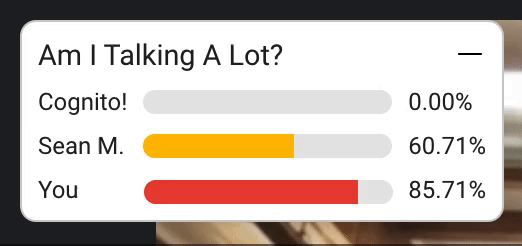

# Am I Talking A Lot?

> ⏱ A Google Chrome extension for keeping track of who is talking during Google Meets

## Features

- Tracks talking time for each participant in a Google Meet
- Displays talking time as a percentage of the whole meeting
- Gently nudges over-talkers to let others speak
- Truncates longer names

## How to use

1. [Download zipped package](https://github.com/SeanMcP/aital-extension/archive/refs/heads/master.zip)
2. Unzip the package
3. Navigate to chrome://extensions/
4. Enable developer mode
5. Click "Load unpacked"
6. Select the unzipped folder
7. Open a Google Meet
